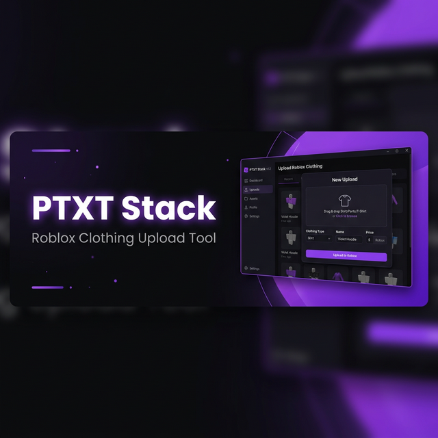

  

<h1 align="center">PTXT Stack</h1>

  <strong>Automação profissional de upload de roupas para Roblox</strong>

  
  
  

  
  &nbsp;
  

---

## ✨ Sobre

O **PTXT Stack** é uma ferramenta desktop profissional para automatizar o upload em massa de roupas para o Roblox. Desenvolvido para criadores que precisam de velocidade, organização e segurança.

## 🚀 Funcionalidades

| Feature | Descrição |
|---------|-----------|
| ⚡ **Zen Mode** | Automação completa — busca roupas, aplica template e faz upload automaticamente |
| 📦 **Templates na Nuvem** | Salve e sincronize seus templates entre dispositivos |
| 👥 **Multi-Grupo** | Envie para múltiplos grupos de uma vez |
| 🔒 **Segurança AES-256** | Criptografia única por instalação — seus dados nunca saem da sua máquina |
| 🚀 **Ultra Rápido** | Upload otimizado com retry automático inteligente |
| 🔄 **Auto-Update** | Verificação automática de novas versões ao iniciar |

## 📥 Instalação

### Windows
1. Baixe o **[PTXT Stack Setup.exe](https://github.com/PTXT-Company/PTXT-STACK/releases/latest/download/PTXT-Stack-Setup.exe)**
2. Execute o instalador
3. O app abre automaticamente — pronto!

### macOS
1. Baixe o **[PTXT Stack.dmg](https://github.com/PTXT-Company/PTXT-STACK/releases/latest/download/PTXT-Stack.dmg)**
2. Abra o `.dmg` e arraste para a pasta Aplicativos
3. Na primeira execução: `Cmd + Clique direito > Abrir`

## 🔒 Segurança

- **Criptografia AES-256** — Cada instalação gera sua própria chave de 32 caracteres
- **Armazenamento local** — Seus cookies Roblox são encriptados no disco e nunca compartilhados
- **Código fechado** — O código-fonte é mantido em repositório privado para proteção dos mecanismos de segurança

## 🔄 Atualizações

O PTXT Stack verifica automaticamente por novas versões ao iniciar. Quando disponível, um banner aparece oferecendo o download direto.

Você também pode conferir a versão mais recente na aba [**Releases**](https://github.com/PTXT-Company/PTXT-STACK/releases).

## 🌐 Links

- 🌍 **Site oficial**: [stack.ptxt.com.br](https://stack.ptxt.com.br)
- 🏢 **PTXT Company**: [ptxt.com.br](https://ptxt.com.br)

## 📋 Changelog

### v1.1.0
- 🔒 Chave de encriptação única por instalação (AES-256)
- 🔒 Cookie do Roblox encriptado no disco
- 📊 Modal de resumo após upload/flow com métricas
- 🔄 Verificação automática de atualizações
- 🧹 Limpeza de arquivos desnecessários

---

  Feito com 💜 por <a href="https://ptxt.com.br">PTXT Company</a>

